## Sommaire

1. [Prérequis techniques](#1-prérequis-technique)
   - [1.1 Prérequis Proxmox](#11-prérequis-proxmox)
   - [1.2 Prérequis pour le script principal Bash](#12-prérequis-pour-le-script-principal-bash)

2. [Installation sur le serveur Debian (Debian 12.9)](#2-installation-sur-le-serveur-debian--debian-129-)
   - [2.1 Installation de OpenSSH-Server](#21-installation-de--open-ssh-server)
   - [2.2 Création d'une paire de clés Debian](#22-création-dune-paire-de-clés-debian)
   - [2.3 Copie de la clé publique sur CLIWIN01](#23-copie-de-la-clé-publique-sur-cliwin01)
   - [2.4 Copie de la clé publique sur CLILIN01](#24-copie-de-la-clé-publique-sur-clilin01)
   - [2.5 Installation de keychain](#25-installation-de-keychain)
   - [2.6 Préparation du serveur Debian pour le script principal](#26-préparation-du-serveur-debian-pour-le-script-principal)

3. [Installation sur le serveur Windows (Windows Server 2022)](#3-installation-sur-le-serveur-windows--windows-serveur-2022-)
   - [3.1 Installation OpenSSH-Client en GUI](#31-installation-openssh-client-en-gui)
   - [3.2 Création d'une paire de clés Windows-Serveur](#32-création-dune-paire-de-clés-windows-serveur)
   - [3.3 Copie de la clé publique sur CLIWIN01](#33-copie-de-la-clé-publique-sur-cliwin01)
   - [3.4 Copie de la clé publique sur CLILIN01](#34-copie-de-la-clé-publique-sur-clilin01)
   - [3.5 Installation et activation de AGENT-SSH](#35-installation-et-activation-de-agentssh)
   - [3.6 Configuration automatique au démarrage](#36-configuration-automatique-au-demarrage)


4. [Installation sur le client Windows (Windows 11)](#4-installation-sur-le-client-windows--windows-11-)
   - [4.1 Installation OpenSSH en CLI](#41-installation-open-ssh-en-cli-pour-la-connexion-avec-debian)
   - [4.2 Modification du fichier de configuration SSH](#42-modification-du-fichier-de-configuration-ssh)
   - [4.3 Dossier d’informations pour les scripts enfants](#43-dossier-dinformations-pour-les-scripts-enfants)

5. [Installation sur le client Linux (Ubuntu 24.04 LTS)](#5-installation-sur-le-client-linux--ubuntu-2404-lts-)
   - [5.1 Installation de OpenSSH-Server](#51-installation-de-openssh-server)
   - [5.2 Configuration du fichier SSH](#52-configuration-du-fichier-de-configuration-ssh)
   - [5.3 Dossier d’informations pour les scripts enfants](#53-dossier-dinformations-pour-les-scripts-enfants)
   - [5.4 Rapatriement automatique des fichiers d’informations](#54-rapatriement-automatique-des-fichiers-dinformations)

6. [FAQ](#6-faq)


## 1. Prérequis technique

### 1.1 Prérequis Proxmox
Nous devons avoir 4 machines Virtuelle sous **PROXMOX** :

- Serveur Debian : 
	Nom : **SRVLX01**
	IP : **172.16.10.10/24**
	
 - Serveur Windows 2022
	Nom : **CLIWIN01**
	IP : **172.16.10.5/24**

- Client Windows 11 :
	Nom : **CLIWIN01**
	IP : **172.16.10.20/24**
		
- Client Linux :
	Nom : **CLILIN01**
	IP : **172.16.10.30/24**

Il faut un compte **ROOT** et **Administrator** sur les 2 serveurs
Il faut un compte utilisateur **wilder** sur les 4 VM
Adresse de **BROADCAST** : **172.16.10.254**
DNS : **8.8.8.8**

### 1.2 Prérequis pour le script principal bash
- Le serveur doit avoir accès SSH aux machines clientes.
- Le fichier /var/log/log_evt.log doit exister et être accessible en écriture.
- Les scripts enfants doivent se trouver dans :
`~/Documents/TSSR-1025-P2-G1/ressources/scripts/`
- Le fichier /var/log/log_evt.log doit être créé et accessible en écriture :
  - sudo touch /var/log/log_evt.log
  - sudo chmod 666 /var/log/log_evt.log

## 2. Installation sur le serveur Debian ( Debian 12.9 )

##### 2.1 Installation de  Open SSH-Server.

Logiquement sur Debian le logiciel **OpenSHH** est installé nativement. Voici la commande pour vérification :

```bash
apt-cache policy openssh-server
```

Voici la Capture d'écran :

 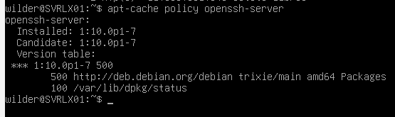
 
  
Nous pouvons constater que **OpenSHH** est bien installé et que nous avons la version 10.0.

Si **OpenSSH** n'est pas installé voici la commande :

```bash
sudo apt update && sudo apt upgrade -y
sudo apt install openssh-server
```

Maintenant vérifions l'état du serveur *SSH*  avec cette commande :

```bash
systemctl status sshd
```


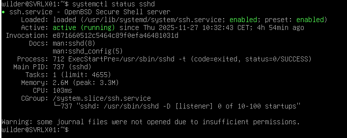

Nous voyons que le statut est bien en mode *active*.

Si cela n'est pas le cas voici la commande pour démarrer le service :

```bash
systemctl start sshd
```

##### 2.2 Création d'une paire de clés Debian

Pour générer la paire de clés voici la commande :

```bash
ssh-keygen -t ed25519 -C "wilder@debian-lab"
```
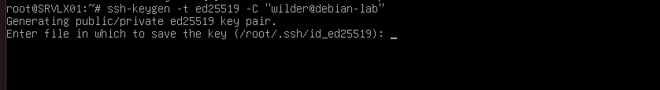
A cette première interrogation, cela nous demande ou on veux stocker la clé. Si on veux la laisser par défaut il faut juste appuyer sur la touche "**ENTREE**" de votre clavier.

Remplir impérativement la **passphrase** ,cela seras le seul mot de passe à retenir pour toutes vos connexions sur vos serveurs possédant cette clé.

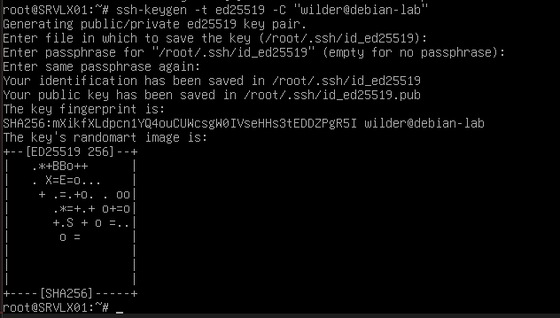


##### 2.3 Copie de la clé Publique sur *CLIWIN01*.

Au préalable nous devons exécuter les tâches du paragraphe "**4.1 Installation OpenSHH**."

Ensuite nous devons créé sur la machine Windows le dossier **.ssh** :

```bash
ssh wilder@CLIWIN01 "mkdir .ssh"
```

On devra saisir le mot de passe *SSH* de l'utilisateur visé.

Puis on copie la clé *Publique* sur la machine Windows avec cette commande :

```bash
scp ~/.ssh/id_ed25519.pub wilder@CLIWIN01:.ssh/authorized_keys
```

##### 2.4 Copie de la clé Publique sur *CLILIN01*.

Au préalable nous devons exécuter les tâches du paragraphe "**5.1 Installation OpenSHH**."

Ensuite on copie la clé *Publique* sur la machine Linux avec cette commande :

```bash
ssh-copy-id wilder@CLILIN01
```
Nous devrions avoir cette affichage :

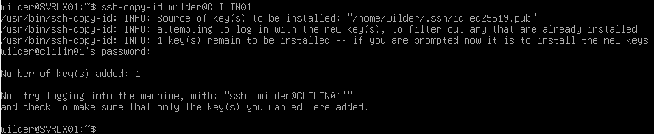

##### 2.5 Installation de keychain

Pour évité d'avoir a taper notre *Passphrase* à chaque connexion **SSH** installons **Keychain** avec ces commandes :

On va commencer par vérifier que notre clé SSH est bien présente sur SRVLX01 :

```bash
ls -al ~/.ssh
```

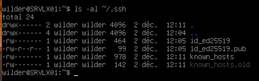

Tapons cette commande pour l'installation de Keychain :

```bash
sudo apt install -y keychain
```

Une fois installé il nous reste plus qu'a modifier le fichier de configuration de **keychain**.

Ouvrons le fichier de configuration à l'aide de cette commande :

```bash
sudo nano ~/.bashrc
```
Ajoutons cette ligne à la fin du fichier :

		eval $(keychain --eval --quiet id_ed25519)


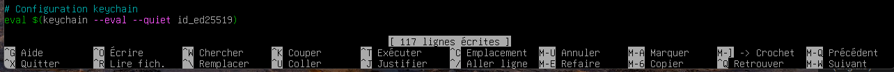

### 2.6 Préparation du serveur Debian pour le script principal

Créer le dossier qui recevra les fichiers d’informations rapatriés :
~/Documents/TSSR-1025-P2-G1/ressources/scripts/info

Ce dossier doit exister pour permettre au script_dady de stocker correctement les données collectées sur les machines clientes.


## 3. Installation sur le serveur Windows ( Windows serveur 2022 )

##### 3.1 Installation OpenSSH-Client en GUI.

Dans la barre de recherche en bas de l'écran il nous faut inscrire 

	optional features

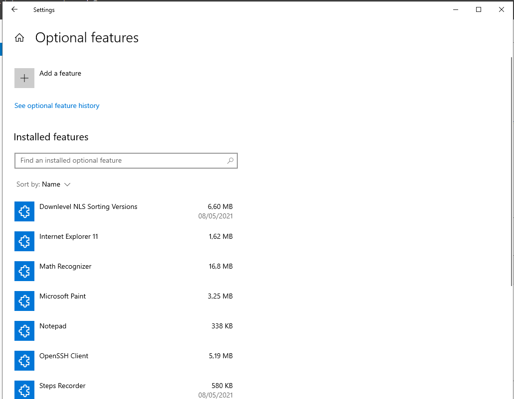

Si **OpenSSH Client** n'est pas installer cliquer sur **Add a feature** pour procéder à l'installation.

##### 3.2 Création d'une paire de clés Windows-Serveur

Pour générer la paire de clés voici la commande :

```bash
ssh-keygen -t ed25519 -C "wilder@srvwin_lab"
```
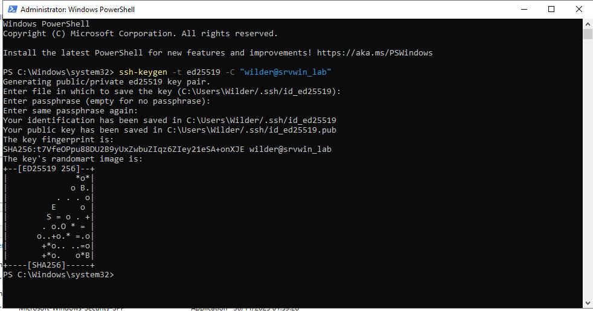
Remplir impérativement la **passphrase** ,cela seras le seul mot de passe à retenir pour toutes vos connexions sur vos serveurs possédant cette clé.

##### 3.3 Copie de la clé Publique sur *CLIWIN01*

Pour copié la clé Publique sur *CLIWIN01* veuillez tapé cette commande :

```bash
ssh wilder@CLIWIN01 "echo $(Get-Content $env:USERPROFILE\.ssh\id_ed25519.pub) >> .ssh/authorized_keys"
```

##### 3.4 Copie de la clé Publique sur *CLILIN01*

Pour copié la clé Publique sur *CLILIN01* veuillez taper cette commande :

```bash
ssh wilder@CLILIN01 "echo $(Get-Content $env:USERPROFILE\.ssh\id_ed25519.pub) >> .ssh/authorized_keys"
```

##### 3.5 Installation et activation de AGENT-SSH

Pour éviter de saisir la passphrase à chaque connexion SSH , il faut activer et configurer le ce service .
	- Ouvrir **PowerShell** en mode **Administrateur** et taper ses commandes :

```bash
Set-Service ssh-agent -StartupType Automatic
Start-Service ssh-agent
```

Nous allons vérifier que le service est démarré avec cette commande :

```bash
Get-Service ssh-agent
```

Voici le résultat attendu :

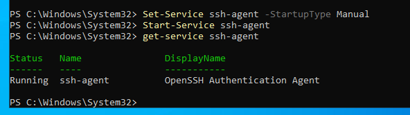

Maintenant il faut ajouter la Clé Privé à l'agent :
	- Ouvrir **PowerShell** en mode normal et taper cette commande :

```bash
ssh-add $env:USERPROFILE\.ssh\id_ed25519
```

La Passphrase sera demander une seule fois,puis sera mémorisée.

Dernière étape on va vérifier que la clé est bien chargée avec cette commande :

```bash
ssh-add -l
```

Voici le résultat attendu :

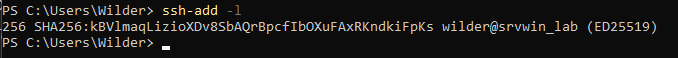

##### 3.6 Configuration automatique au démarrage de PowerShell

Cette étape va servir à chargé automatiquement la clé Privé dans le SSH-Agent à chaque ouverture de PowerShell.

On va créé le fichier Profile avec cette commande :

```bash
New-Item -Path $PROFILE -ItemType File -Force
```

Voici le résultat attendu :


Nous allons maintenant ouvrir ce fichier avec le Bloc note et ajouter cette ligne dans ce fichier :

		ssh-add $env:USERPROFILE\.ssh\id_ed25519

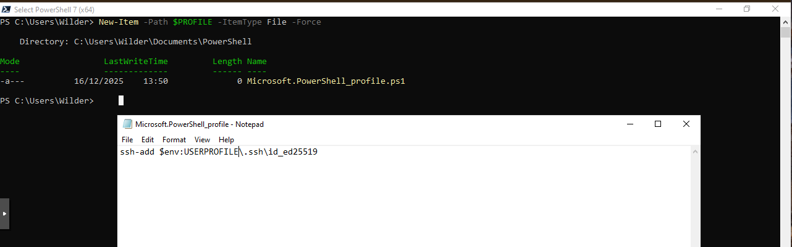

Maintenant à chaque redémarrage du serveur et à la 1ère ouverture de Powershell il va nous demander d'entrer notre Passphrase :

Une fois la Passphrase validé elle ne vous seras plus demandé jusqu'au prochain démarrage du serveur.

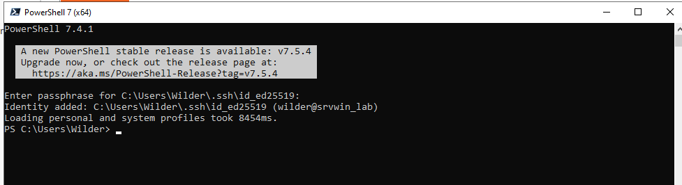


## 4. Installation sur le client Windows ( Windows 11 )
##### 4.1 Installation Open SSH en CLI pour la connexion avec Debian

1. Ouvrir PowerShell en mode **administrateur**

```bash
Add-WindowsCapability -Online -Name OpenSSH.Server~~~~0.0.1.0
```

2. Une fois l'installation terminé, il faut démarré le service :

```bash
Start-Service sshd
```

3. On configure le service pour qu'il démarre automatiquement

```bash
Set-Service -Name sshd -StartupType "Automatic"
```
Pour contrôler si le service sshd est activé , tapons cette commande :

```bash
Get-Service sshd
```

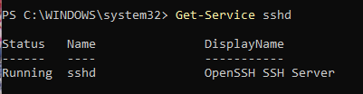

##### 4.2 Modification du fichier de configuration *SSH*

Commencer par ouvrir **PowerShell** en tant qu'administrateur.

Ensuite ce rendre dans le dossier suivant :

```bash
notepad C:\ProgramData\ssh\sshd_config
```

Il faut dé-commenter cette ligne = Enlever le **#** devant pour l'activer

	PubkeyAuthentication yes

Il faut Commenter cette ligne = Ajouter un **#** devant pour la désactiver

	PasswordAuthentication yes

Nous devons également ajouter les lignes suivantes pour améliorer la sécurité :

		PermitRootlogin no
		AllowUSers wilder
		
Faire un **CTRL+S** pour sauvegarder le fichier après les modifications

Nous allons copier notre clé publique vers le fichiers des administrateur avec cette commande :

```bash
Copy-Item C:\Users\wilder\.ssh\authorized_keys C:\ProgramData\ssh\administrators_authorized_keys
```

Dernière étape mais très importante nous devons redémarrer le service **sshd** avec cette commande :

```bash
 Restart-Service sshd
```

Ensuite voici la commande pour tester la connexion *SSH* depuis Debian pour se connecter avec la **passphrase** sur windows :

```bash
ssh wilder@CLIWIN01
```

il me reste la sécurité des fichiers .ssh dans windows en graphique

### 4.3 Dossier d’informations pour les scripts enfants

Les scripts enfants stockent leurs informations dans le dossier :
`C:\Users\<user>\Documents\info`

Ce dossier est créé automatiquement lors de l’exécution des scripts enfants envoyés par le script principal.


## 5. Installation sur le client Linux ( Ubuntu 24.04 LTS )

##### 5.1 Installation de OpenSSH-server.

Nous devons exécuter les commandes suivantes pour l'installation :

```bash
sudo apt update && sudo apt upgrade -y
sudo apt install openssh-server -y
sudo systemctl start ssh 
sudo systemctl enable ssh
```
Ensuite contrôlons le statut du service avec cette commande :

```bash
sudo systemctl status ssh
```
Nous devrions avoir l'affichage suivant : 

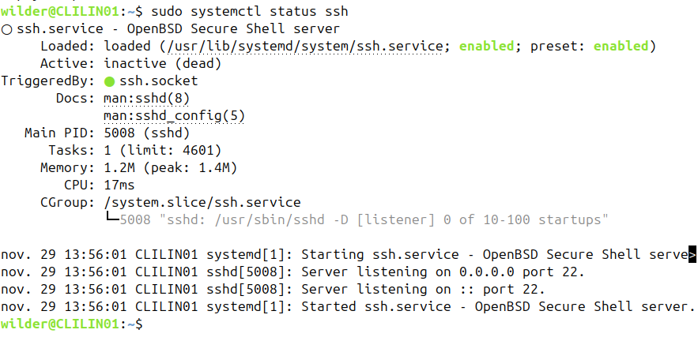

##### 5.2 Configuration du fichier de configuration SSH.

Exécutons cette commande pour nous rendre dans le fichier de configuration :

```bash
sudo nano /etc/ssh/sshd_config
```
Dans ce fichier nous devons ajouter les lignes suivantes pour améliorer la sécurité :

		PermitRootlogin no
		AllowUSers wilder

Il faut dé-commenter cette ligne = Enlever le **#** devant pour l'activer

		PubkeyAuthentication yes
		PasswordAutentication no

Faire un **CTRL+O** puis **ENTRER** pour sauvegarder et **CTRL+X** pour sortir du fichier après les modifications.	

Dernière étape mais très importante nous devons redémarrer le service **ssh** avec cette commande :

```bash
sudo systemctl restart ssh
```
Ensuite voici la commande pour tester la connexion *SSH* depuis Debian pour se connecter avec la **passphrase** sur CLILIN01 :

```bash
ssh wilder@CLILIN01
```
Nous devrions avoir cette affichage :

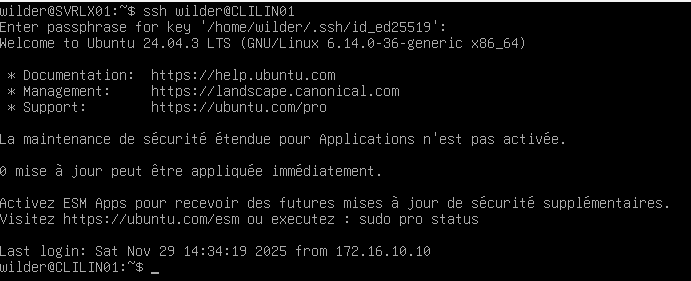

Maintenant nous allons exécuter ses deux commandes pour sécurisés l’accès a notre clé *Publique* :

```bash
chmod 700 ~/.ssh
chmod 600 ~/.ssh/authorized_keys
```
Nous pouvons vérifié les droits avec cette commande :

```bash
ls -la ~/.ssh
```
Nous devrions avoir cette affichage :


### 5.3 Dossier d’informations pour les scripts enfants

Les scripts enfants stockent leurs informations dans le dossier :
`~/Documents/info`

Ce dossier est créé automatiquement lors de l’exécution des scripts enfants envoyés par le script principal.

### 5.4 Rapatriement automatique des fichiers d'informations

Après l’exécution d’un script enfant, le script principal rapatrie automatiquement 
les fichiers d’informations stockés sur la machine cliente.

Pour un client Linux :
`scp <user>@<hostname>:~/Documents/info/* ~/Documents/TSSR-1025-P2-G1/ressources/scripts/info/`

Pour un client Windows :
`scp <user>@<hostname>:C:/Users/$target_user/Documents/info/* ~/Documents/TSSR-1025-P2-G1/ressources/scripts/info/`

Toutes les informations collectées sont donc centralisées sur le serveur Debian,
dans le dossier :
`~/Documents/TSSR-1025-P2-G1/ressources/scripts/info/`

## 6. FAQ

Q : Aucun fichier n’a été rapatrié par le script principal, que faire ?<br>
R : Vérifier que le dossier ~/Documents/info (Linux) ou C:\Users\<user>\Documents\info (Windows)
    existe bien sur la machine cliente et qu’il contient des fichiers.

Q : SSH me renvoie "Permission denied".<br>
R : Vérifier que la clé publique est bien installée et que l’utilisateur est autorisé
    dans la configuration sshd.

Q : Le script ne veut pas lancer une commande sur Windows.<br>
R : Vérifier que PowerShell autorise l’exécution de scripts via :
    Set-ExecutionPolicy RemoteSigned


